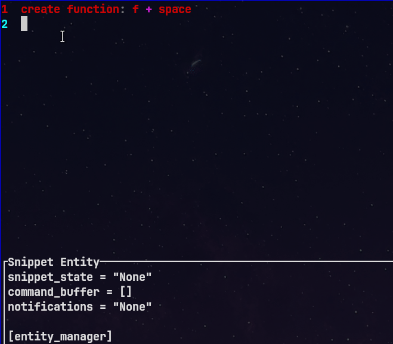
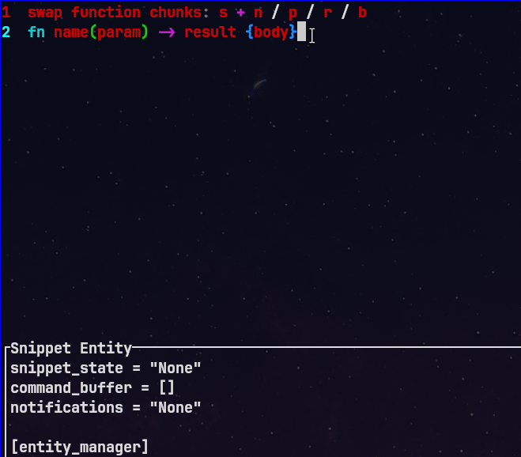
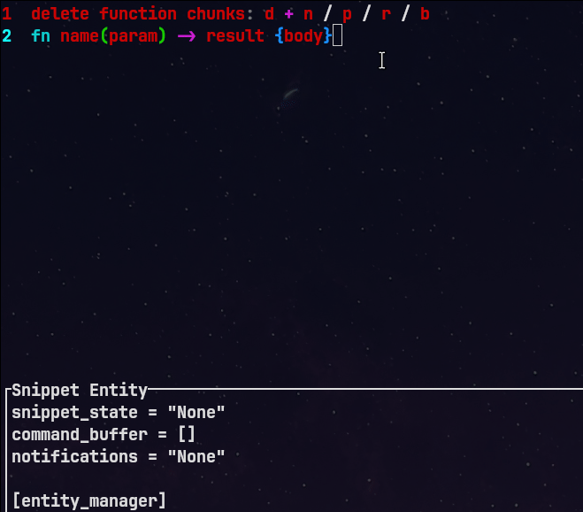
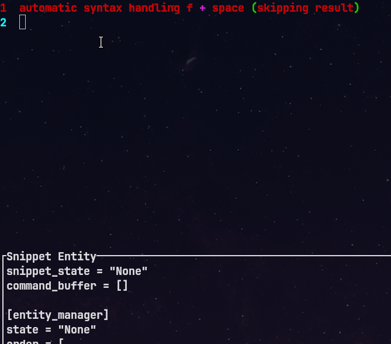
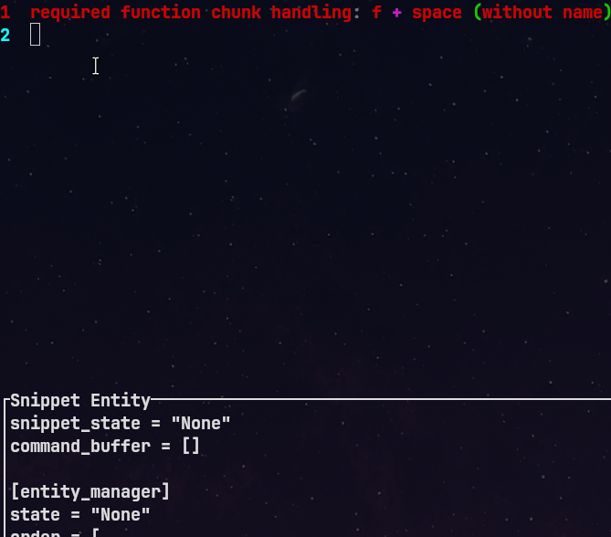
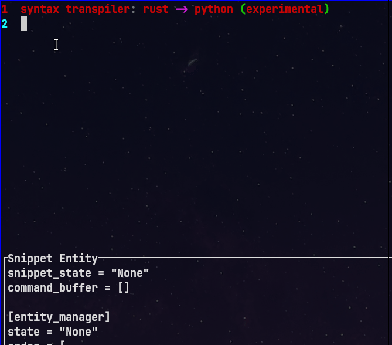

# eLarge — Snippet-First, Code-First Editor

**eLarge** is a next-generation, snippet-first code editor written in **Rust**, inspired by the design philosophies of **Helix**, **Kakoune**, **Vim**, and **Bevy ECS**. It introduces a **language-agnostic**, **mode-based**, and **snippet-centric** editing model where every syntactic element is treated as a structured entity rather than raw text.

In its current form, eLarge is an **early preview** and **proof-of-concept**.

---

## Core Concepts

### Everything Is a Snippet

In eLarge, every part of code — from a function to a parameter — is represented as a *snippet entity*. Instead of working with arbitrary text, you work with *structured code units*.

### Unified Editing Model

Traditional Vim-like modes are reimagined into action-based categories:

| Action       | Description                       | Example Keybind | Example Meaning   |
| ------------ | --------------------------------- | --------------- | ----------------- |
| **Create**   | Add a new entity                  | `c + f`         | Create Function   |
| **Delete**   | Remove an existing entity         | `d + f`         | Delete Function   |
| **Swap**     | Replace or reorder entities       | `s + f`         | Swap Function     |
| **Refactor** | Rename, move, or reshape entities | `r + f`         | Refactor Function |
| **Find**     | Locate an entity in the codebase  | `f + f`         | Find Function     |
| **Goto**     | Jump directly to a defined entity | `g + f`         | Go to Function    |

Each command follows the same composable pattern: **action + entity**.

---

## Entity Composition

Every language construct (like a function or class) is made up of smaller entities. For example, a **function** consists of:

| Component  | Description                  |
| ---------- | ---------------------------- |
| **Name**   | Identifier of the function   |
| **Params** | Function arguments and types |
| **Result** | Return type                  |
| **Body**   | Function implementation      |

When editing within a function, the entity context is implicit. For instance:

| Action   | Command | Meaning                |
| -------- | ------- | ---------------------- |
| Delete   | `d + n` | Delete Function Name   |
| Swap     | `s + n` | Swap Function Name     |
| Refactor | `r + b` | Refactor Function Body |

This structure makes eLarge **functionally and linguistically agnostic**. Once you know how to manipulate a function in one language, you can do it in any other.

---

## Syntax Transpiler

eLarge includes an **interactive syntax transpiler** — a system that lets you define, customize, and transform syntax rules at runtime.

For example, if you dislike C#’s verbosity or keyword order, you can redefine it dynamically:

**C# Example:**

```c#
public int Add(int num1, int num2)
{
    int sum = num1 + num2;
    return sum;
}
```

**Custom Syntax:**

```custom
pub Add(num1: int, num2: int) -> Int
{
    int sum = num1 + num2;
    return sum;
}
```

You can modify:

* `public` → `pub`
* Argument syntax: `int num1` → `num1: int`
* Declaration order, indentation, and structure

This creates a **language-independent playground**, where syntax adapts to your habits rather than forcing you to learn new syntax rules.

---

## Why Another Editor?

Unlike Vim or JetBrains IDEs, **eLarge treats code, not text, as the core editing unit**. It interprets everything through structured snippets, enabling more intelligent and consistent editing.

### Key Advantages

1. **Guaranteed Correct Syntax**
   The editor ensures valid syntax and prevents accidental deletion of structural elements.

2. **Accurate and Efficient LSP Integration**
   LSP queries are sent only when snippets are complete, providing cleaner, more relevant diagnostics and better performance.

3. **Smarter Autosuggestions**
   Context-aware snippet recognition means no unnecessary completions — LSP triggers only when it matters.

4. **Customizable Formatting Rules**
   Formatting becomes configuration-based. Each developer can have personal formatting preferences that automatically merge into a shared team configuration.

5. **Precise Motions**
   Navigation and motion commands target syntax-aware entities, not raw text regions.

6. **Cleaner Error Reporting**
   Most syntax-related LSP errors disappear — since incomplete snippets are recognized as “in-progress.”

7. **Powerful AI Integration**
   Because every element is structured, eLarge can query LLMs using only essential data — function names, arguments, and types — drastically reducing token usage and improving accuracy. Syntax formatting is handled by the editor itself.

#### Example — Privacy-Aware Refactoring

Original code:

```python
class BankUser:
    def __init__(self, data):
        self.balance = data
        self.name = None
```

Anonymized transformation:

```python
class SomeClass:
    def __init__(self, data):
        self.some_float = data
        self.some_string = None
```

You can safely query AI tools without exposing sensitive business logic.

8. **Unparalleled Refactoring Power**
   With structured entities, global transformations (via LLMs or static analysis) become reliable and context-preserving.

---

## Project Goals

1. Build a **fully featured IDE**
2. Create an **interactive syntax transpiler** and dynamic Tree-sitter–like specification builder
3. Develop a **universal macro system** that works across languages
4. Provide an **intermediate representation (IR)** for seamless learning and translation between languages

---

## Roadmap

| Phase | Feature         | Description                                                  |
| ----- | --------------- | ------------------------------------------------------------ |
| **1** | LSP Integration | Intelligent request scheduling & entity-level diagnostics    |
| **2** | TUI Tools       | Build the terminal-based interface using Ratatui/Bevy ECS    |
| **3** | LLM Integration | Context-aware refactoring, syntax generation & transpilation |

---

**eLarge** redefines how we interact with code — transforming editing into a semantic, language-agnostic, AI-augmented process.

# preview






